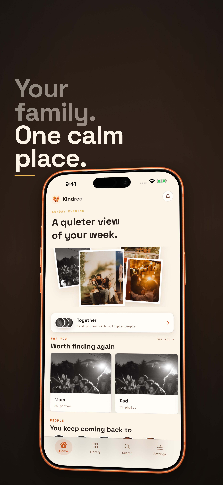
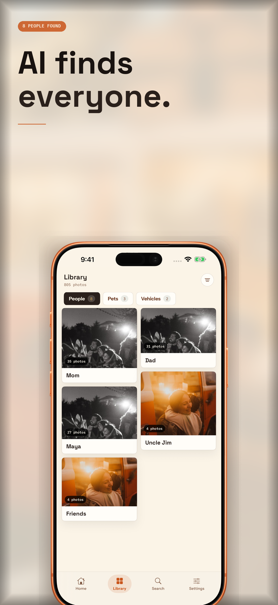
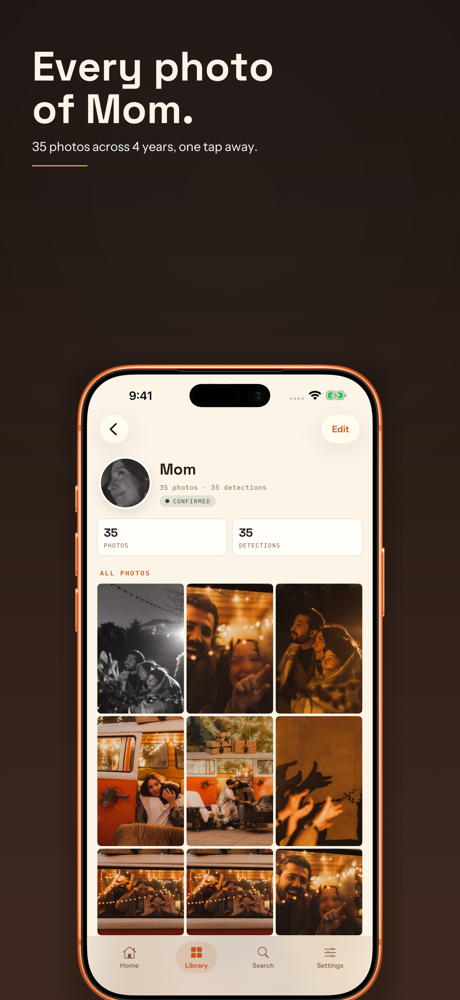
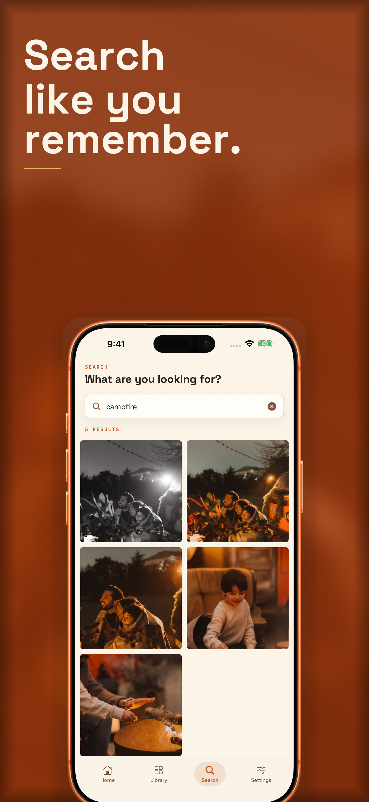
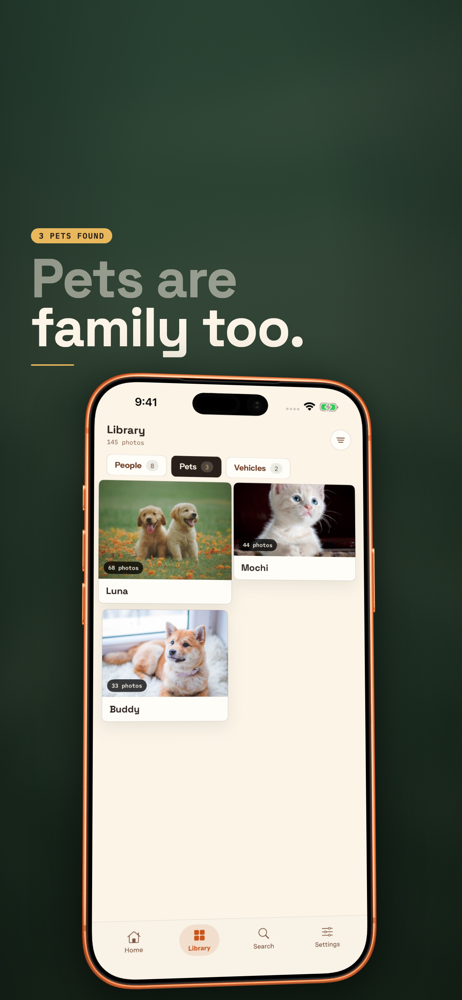
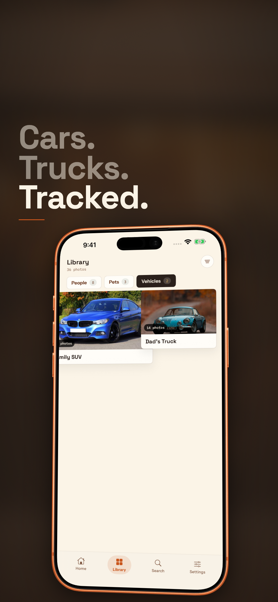
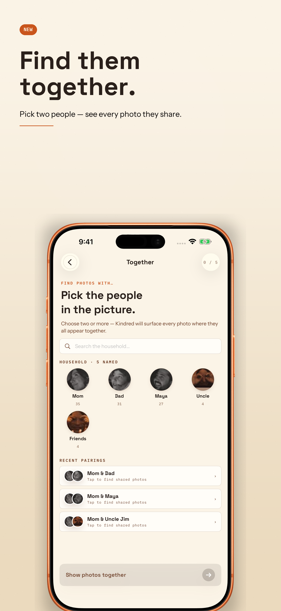
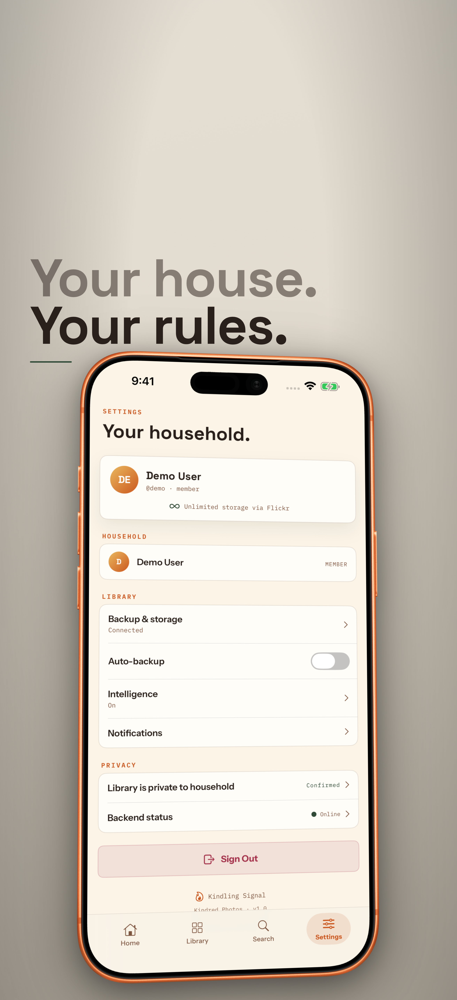

<p align="center">
  
</p>

<h1 align="center">Kindred Photos</h1>

<p align="center">
  <em>A calmer home for family photos.</em>
</p>

<p align="center">
  <a href="https://kindredphotos.app"></a>
  <a href="https://demo.kindredphotos.app"></a>
  <a href="#license"></a>
  
  
  
</p>

---

Kindred is a **self-hosted family photo organizer** that uses your existing Flickr account as the storage backend. Your photos never leave Flickr -- Kindred simply layers intelligence on top: face clustering, pet and vehicle recognition, natural-language search, text extraction, and a household model so the whole family can enjoy the library together.

No cloud lock-in. No subscription. Your photos, your server.

---

## Screenshots

<table>
  <tr>
    <td align="center"><br /><sub>Home Feed</sub></td>
    <td align="center"><br /><sub>People</sub></td>
    <td align="center"><br /><sub>Person Detail</sub></td>
    <td align="center"><br /><sub>Search</sub></td>
  </tr>
  <tr>
    <td align="center"><br /><sub>Pets</sub></td>
    <td align="center"><br /><sub>Vehicles</sub></td>
    <td align="center"><br /><sub>Together</sub></td>
    <td align="center"><br /><sub>Settings</sub></td>
  </tr>
</table>

---

## Features

### AI-Powered Organization
- **Face clustering** -- InsightFace detects and groups faces automatically. Name a cluster once and every past and future photo is organized.
- **Pet recognition** -- Dogs, cats, and other animals are detected and clustered, each with their own profile.
- **Vehicle recognition** -- Cars, trucks, motorcycles -- recognized and grouped by identity.
- **Scene tagging** -- Photos are classified into scenes like *beach*, *birthday party*, *hiking*, *kitchen* and more.
- **Object detection** -- YOLOv8 identifies objects in every photo.
- **Text extraction (OCR)** -- Tesseract pulls text from screenshots, signs, documents, and whiteboards so you can search for it later.

### Search That Actually Works
- **Natural-language search** -- Powered by OpenCLIP (ViT-B/32), type "sunset over the ocean" or "kids playing in snow" and get results ranked by visual similarity.
- **Color search** -- Find photos by dominant color.
- **Text search** -- Search for words found inside photos via OCR.
- **Fuzzy name search** -- Find people, pets, and vehicles by name with typo-tolerant matching.

### Together
Select two or more people and instantly see every photo where they appear together. A simple way to revisit shared moments.

### Household Sharing
- One admin connects their Flickr account and sets up the household.
- Family members join with an invite code -- no Flickr account required.
- Role-based access: **admin** and **member** roles.
- Per-user API keys for the iOS app.

### Privacy First
- **Self-hosted** -- runs on your own hardware or VPS.
- **Flickr as storage** -- photos live in your Flickr account, not on a third-party AI service.
- **All AI runs locally** -- face detection, CLIP embeddings, object detection, and OCR all run on your server. Nothing is sent to external APIs.
- **No telemetry** in self-hosted mode.

### More
- **Timeline view** -- browse photos chronologically with smart date grouping.
- **Map view** -- see where your photos were taken on an interactive Leaflet map.
- **Events** -- auto-grouped clusters of photos taken around the same time and place.
- **Duplicate detection** -- find and manage duplicate photos.
- **Upload** -- add photos directly from the web or iOS app; they upload straight to Flickr.
- **Background sync** -- the iOS app syncs in the background so your library stays fresh.

---

## Architecture

```
                      +------------------+
                      |    Flickr API    |
                      |  (photo storage) |
                      +--------+---------+
                               |
                      +--------+---------+
                      |   Kindred API    |
                      |   (FastAPI)      |
                      |                  |
                      |  InsightFace     |
                      |  OpenCLIP        |
                      |  YOLOv8          |
                      |  Tesseract OCR   |
                      +--------+---------+
                               |
              +----------------+----------------+
              |                                 |
    +---------+---------+            +----------+----------+
    |    Web Frontend   |            |      iOS App        |
    |    (Next.js)      |            |     (SwiftUI)       |
    |                   |            |  iPhone + iPad      |
    +-------------------+            +---------------------+
```

**How it works:** The admin connects their Flickr account during setup. Kindred periodically syncs the photo list from Flickr, downloads images for analysis, runs AI models (face detection, CLIP embedding, object detection, OCR), and stores the resulting metadata and vector embeddings in PostgreSQL with pgvector. The original photos always remain on Flickr. Clients (web and iOS) talk to the Kindred API for everything -- browsing, searching, uploading -- and photo images are proxied through the API from Flickr.

---

## Self-Hosting Guide

### Prerequisites

- **Docker** and **Docker Compose**
- A **Flickr account** with API credentials ([request an API key](https://www.flickr.com/services/apps/create/))
- **PostgreSQL 15+** with the [pgvector](https://github.com/pgvector/pgvector) extension (or use a managed database)
- **4 GB+ RAM** recommended (AI models are loaded into memory)

### 1. Clone the repository

```bash
git clone https://github.com/kindlingsignal/kindred.git
cd kindred
```

### 2. Configure the backend

```bash
cd backend
cp .env.example .env  # then edit with your credentials
```

Required environment variables:

| Variable | Description |
|---|---|
| `DATABASE_URL` | PostgreSQL connection string (must have pgvector) |
| `FLICKR_API_KEY` | Your Flickr API key |
| `FLICKR_SECRET` | Your Flickr API secret |
| `FLICKR_OAUTH_TOKEN` | OAuth token from Flickr auth flow |
| `FLICKR_OAUTH_SECRET` | OAuth secret from Flickr auth flow |
| `FLICKR_USER_ID` | Your Flickr user NSID |
| `SCAN_SECRET` | Secret for triggering automated scans |
| `CORS_ORIGINS` | Comma-separated allowed origins (optional) |

### 3. Start the backend

```bash
docker compose up -d
```

This starts the FastAPI backend on port 8000 behind an Nginx reverse proxy on port 80.

### 4. Initial setup

Open `http://your-server/docs` and call the `/auth/setup` endpoint to create the admin account, or visit the web frontend and follow the setup flow.

### 5. Set up the web frontend

```bash
cd apps/web
npm install
```

Create a `.env.local` file:

```
NEXT_PUBLIC_API_URL=http://your-server
```

```bash
npm run build
npm start
```

The web app runs on port 3000 by default.

### 6. iOS app

Open `apps/ios/Kindred.xcodeproj` in Xcode. Update the server URL in the app settings when you first launch. Build and run on your device or simulator.

### 7. Trigger the first scan

Once the backend is running and Flickr is connected, trigger a scan to import and analyze your photo library:

```bash
curl -X POST http://your-server/scan/auto \
  -H "X-API-Key: your-api-key"
```

The scan runs in the background. Depending on library size, the initial import may take a while -- subsequent syncs are incremental.

---

## Live Demo

Try Kindred without setting anything up:

**[demo.kindredphotos.app](https://demo.kindredphotos.app)**

The demo runs with stock photography from [Pexels](https://www.pexels.com/) and pre-computed AI data. It showcases the full browsing experience -- people, pets, vehicles, scenes, search, and the Together feature -- without connecting to a real Flickr account.

---

## Tech Stack

| Layer | Technology |
|---|---|
| **Backend** | Python 3.11, FastAPI, Uvicorn |
| **Database** | PostgreSQL + pgvector |
| **AI / ML** | InsightFace (face detection/embedding), OpenCLIP ViT-B/32 (visual search), YOLOv8 (object detection), Tesseract (OCR) |
| **Web** | Next.js 16, React 19, TailwindCSS 4, TanStack Query, Leaflet |
| **iOS** | SwiftUI, async/await, background tasks |
| **Infrastructure** | Docker, Nginx, Flickr API (OAuth 1.0a) |
| **Fonts** | Space Grotesk, Instrument Sans, IBM Plex Mono |
| **Analytics** | PostHog (optional, demo/web only) |

---

## Project Structure

```
kindred/
  apps/
    web/           Next.js web frontend
    ios/           SwiftUI iOS app (iPhone + iPad)
  backend/
    main.py        FastAPI application (API, AI pipeline, Flickr sync)
    Dockerfile     Container image for the backend
    docker-compose.yml
    requirements.txt
  screenshots/     App Store and marketing screenshots
  tools/           Screenshot generation and framing utilities
  docs/            Supplementary documentation
```

---

## Contributing

Kindred is open source under the AGPL-3.0 license. Contributions are welcome.

1. **Fork** the repository
2. **Create a branch** for your feature or fix
3. **Submit a pull request** with a clear description of what changed and why

A few guidelines:

- Keep the backend as a single `main.py` for now -- this is intentional for simplicity during early development.
- iOS changes should work on both iPhone and iPad.
- Web changes should be responsive and match the existing visual language (Space Grotesk headings, Instrument Sans body text, warm neutral palette).

For bugs or feature ideas, open an issue.

---

## License

Kindred Photos is licensed under the [GNU Affero General Public License v3.0](https://www.gnu.org/licenses/agpl-3.0.html) (AGPL-3.0).

You are free to self-host, modify, and distribute Kindred. If you run a modified version as a network service, you must make your source code available under the same license.

---

## Credits

**Kindred Photos** is built by [Kindling Signal](https://kindredphotos.app).

Demo photography provided by [Pexels](https://www.pexels.com/) contributors -- free to use under the Pexels license.

Open-source libraries that make Kindred possible: FastAPI, InsightFace, OpenCLIP, Ultralytics YOLOv8, pgvector, Next.js, and SwiftUI.

---

<p align="center">
  <sub>Built with care for families who want to own their memories.</sub>
</p>
